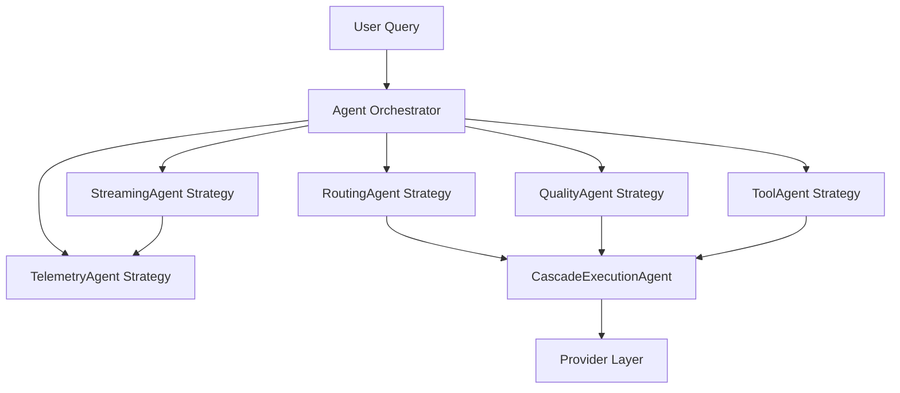

# Agents Strategy Pattern Analysis for cascadeflow

## Purpose
Assess whether cascadeflow should refactor toward an **Agents strategy pattern** and document a recommended path forward.

---

## What is the “Agents Strategy Pattern” (AI/LLM context)?
The **Agents strategy pattern** applies classic Strategy/Policy patterns to AI workflows by encapsulating **capabilities (tools, routing, validation, planning, cost tracking)** into **agent-like components** with a shared interface. A coordinating **orchestrator** selects which strategy/agent executes a given step based on context (domain, complexity, tools, or cost).

**Typical characteristics:**
- **Agent interface**: `run(context) -> result` or `plan(context) -> actions`.
- **Pluggable strategies**: Each agent represents a distinct strategy (e.g., routing, tool execution, quality validation).
- **Context pipeline**: Shared context passes through multiple agents; each agent can enrich or transform context.
- **Orchestrated selection**: The orchestrator chooses which agent(s) to execute based on rules or learned policy.

This pattern is common in LLM frameworks that separate planning, tool use, and evaluation into discrete agents.

---

## How major frameworks structure agents
### LangChain
- Uses **agent executors** that choose tools based on an internal policy.
- Models are encapsulated as **LLM wrappers**, while tools and tool selection policies are treated as pluggable components.

### CrewAI
- Centers on **role-based agents** (e.g., researcher, writer) with a defined scope.
- Defines workflows where agents sequentially hand off context to one another.

### AutoGen
- Implements **multi-agent chat** patterns where agents communicate and collaborate through a message bus.
- Policies can be rule-based or LLM-driven, allowing flexible agent orchestration.

Across frameworks, the pattern is consistent: **agents act as strategies** that can be swapped, composed, or orchestrated.

---

## Current cascadeflow architecture analysis
### Engines/Subsystems in cascadeflow
From the architecture documentation, cascadeflow is composed of multiple subsystems/engines:
- **Core execution engine** (speculative cascade) under `core/`.
- **Quality validation system** under `quality/`.
- **Routing & decision logic** under `routing/`.
- **Streaming response handling** under `streaming/`.
- **Telemetry & cost tracking** under `telemetry/`.
- **Tool calling framework** under `tools/`.
- **Provider implementations** under `providers/`.
- **Utilities & interface components** under `utils/` and `interface/`.

These are all wired together inside the main **CascadeAgent** orchestrator (`cascadeflow/agent.py`). The agent coordinates routing, tool streaming, telemetry, and domain detection in one central class. The orchestration path explicitly controls:
- complexity/domain routing,
- tool capability filtering,
- streaming module selection,
- cost calculation and telemetry aggregation,
- UI feedback.

### How components are currently coupled
The `CascadeAgent` directly imports and orchestrates:
- **Routing**: `PreRouter`, `ToolRouter`, `DomainDetector`, `SemanticDomainDetector`.
- **Streaming**: `StreamManager` and `ToolStreamManager`.
- **Telemetry**: `CostCalculator`, `MetricsCollector`, `CallbackManager`.
- **Quality configuration**: `QualityConfig`.
- **Core cascade execution**: `WholeResponseCascade`.

This centralizes routing, streaming selection, and telemetry in one monolithic coordinator. This is efficient but creates **tight coupling** between the agent and the internal engines.

### Current architecture diagram (simplified)
```mermaid
flowchart TD
    User[User Query] --> Agent[CascadeAgent]

    Agent --> Routing[Routing Engine\n(PreRouter/ToolRouter/DomainDetector)]
    Agent --> Quality[Quality Engine\n(Confidence/Complexity/Validators)]
    Agent --> Core[Core Cascade Engine\n(WholeResponseCascade)]
    Agent --> Streaming[Streaming Engine\n(StreamManager/ToolStreamManager)]
    Agent --> Tools[Tool Engine\n(ToolExecutor/Tool configs)]
    Agent --> Telemetry[Telemetry Engine\n(CostCalculator/MetricsCollector)]
    Agent --> Providers[Provider Layer\n(OpenAI/Anthropic/etc.)]

    Routing --> Core
    Quality --> Core
    Core --> Providers
    Core --> Tools
    Tools --> Providers
    Core --> Streaming
    Streaming --> Telemetry
```

---

## Pain points observed in the current design
From the architecture and orchestrator logic, current pain points likely include:
1. **Centralized orchestration**: The `CascadeAgent` directly wires multiple engines, making it a single “god class.”
2. **Tight coupling**: Changes to routing/telemetry/streaming often require `CascadeAgent` changes.
3. **Limited extensibility**: Adding a new engine often means modifying agent orchestration code.
4. **Testing complexity**: Unit tests for the agent can be brittle because many subsystems are co-dependent.

---

## Would an Agents strategy pattern improve cascadeflow?
### 1. Modularity
✅ Likely improved. Each engine becomes a discrete agent/strategy with a stable interface.

### 2. Extensibility
✅ Improved. Adding a new strategy (e.g., a “SafetyAgent” or “PolicyAgent”) could become a plug-in rather than a direct modification of `CascadeAgent`.

### 3. Testing
✅ Improved. Each agent could be tested in isolation with mocked context.

### 4. Third-party integrations
✅ Improved. External integrations can be packaged as agents (ex: a custom routing agent or domain agent) without altering the core orchestrator.

---

## Potential downsides / risks
- **Increased abstraction complexity**: More layers may make debugging harder.
- **Performance overhead**: Additional agent boundary checks and context passing can add overhead if not optimized.
- **Migration cost**: Refactoring existing orchestration into agent modules is non-trivial.
- **API stability risks**: Existing users may rely on specific orchestration behaviors.

---

## Proposed agents architecture (if adopted)
### Concept
Introduce **AgentStrategy** interface with context-driven execution. Each subsystem maps to a specialized agent.

### Proposed architecture diagram (simplified)


---

## Pros/Cons comparison
| Dimension | Current (Central Agent) | Agents Strategy Pattern |
|---|---|---|
| Modularity | Medium | High |
| Extensibility | Medium | High |
| Testing | Medium | High |
| Performance | High | Medium (slight overhead) |
| Complexity | Low | Medium/High |
| Change risk | Low (inertia) | Medium/High (refactor) |

---

## Recommendation
**Recommendation: Move toward a lightweight Agents strategy pattern, but incrementally.**

Rationale:
- cascadeflow already uses distinct subsystems with well-defined boundaries, making them good candidates for agent strategies.
- The current `CascadeAgent` is densely coupled; extracting orchestration into composable agents would increase maintainability and allow ecosystem contributions.
- A full refactor is risky; incremental extraction preserves API stability while realizing modularity gains.

---

## Suggested migration path (incremental)
1. **Phase 1 – Introduce AgentStrategy interface**
   - Define a minimal interface for agent strategies (`run(context) -> context/result`).
   - Wrap existing routing/quality/telemetry steps without changing behavior.

2. **Phase 2 – Extract Routing + Quality agents**
   - Convert routing (PreRouter/ToolRouter/DomainDetector) into a `RoutingAgent`.
   - Convert quality evaluation into a `QualityAgent`.

3. **Phase 3 – Extract Tool + Streaming agents**
   - Isolate tool execution selection + streaming into dedicated strategies.

4. **Phase 4 – Orchestrator polish + plugin registry**
   - Add dynamic registry for third-party agents.
   - Define ordering rules and context contract.

5. **Phase 5 – Deprecate direct orchestration in CascadeAgent**
   - Maintain backwards compatibility until a major version release.

---

## Final conclusion
A measured shift toward an Agents strategy pattern appears beneficial for **modularity, extensibility, testing, and integrations**, with manageable risk if executed incrementally. The existing subsystem boundaries in cascadeflow are already aligned to this architecture, making refactoring practical if undertaken in phases.
