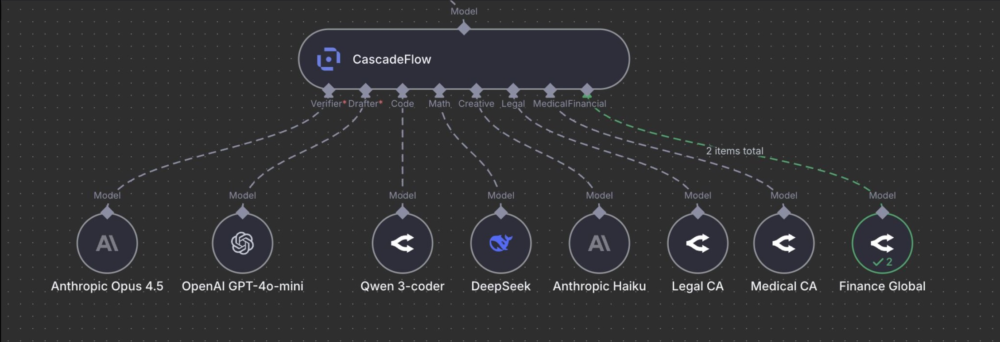

<div align="center">

<picture>
  <source media="(prefers-color-scheme: dark)" srcset="../../../.github/assets/CF_logo_bright.svg">
  <source media="(prefers-color-scheme: light)" srcset="../../../.github/assets/CF_logo_dark.svg">
  
</picture>

# @cascadeflow/n8n-nodes-cascadeflow

[](https://www.npmjs.com/package/@cascadeflow/n8n-nodes-cascadeflow)
[](../../../LICENSE)
[](https://n8n.io/)

** n8n community node for cascadeflow**

</div>

**Intelligent AI model cascading for n8n workflows with domain understanding.**



This package provides **two nodes** for n8n workflows:

| Node | Type | Use case |
|------|------|----------|
| **CascadeFlow (Model)** | Language Model sub-node | Drop-in replacement for any AI Chat Model. Wire into Basic LLM Chain, Chain, or any node that accepts a Language Model. |
| **CascadeFlow Agent** | Standalone agent node | Full agent with tool calling, memory, and multi-step reasoning. Wire directly into workflows like Chat Trigger → Agent → response. |

Both nodes share the same cascade engine: try a cheap drafter first, validate quality, escalate to a verifier only when needed. **40-85% cost savings.**

[n8n](https://n8n.io/) is a fair-code licensed workflow automation platform.

## Installation

Follow the [installation guide](https://docs.n8n.io/integrations/community-nodes/installation/) in the n8n community nodes documentation.

### Community Nodes (Recommended)

1. Go to **Settings** > **Community Nodes**
2. Select **Install**
3. Enter `@cascadeflow/n8n-nodes-cascadeflow` in **Enter npm package name**
4. Agree to the risks and install

### Manual installation

```bash
npm install @cascadeflow/n8n-nodes-cascadeflow
```

For Docker-based deployments add the following line before the font installation command in your [n8n Dockerfile](https://github.com/n8n-io/n8n/blob/master/docker/images/n8n/Dockerfile):

```dockerfile
RUN cd /usr/local/lib/node_modules/n8n && npm install @cascadeflow/n8n-nodes-cascadeflow
```

---

## Node 1: CascadeFlow (Model)

A **Language Model sub-node** (`ai_languageModel` output) that acts as a drop-in cascading wrapper around two models.

### When to use

- You want to plug cascadeflow into an existing chain or LLM node
- No tool calling or memory needed
- Works with: Basic LLM Chain, Chain, Question and Answer Chain, Summarization Chain, and any node that accepts a Language Model input

### Architecture

```
┌─────────────┐
│  Drafter    │ (e.g., Claude Haiku, GPT-4o-mini)
└──────┬──────┘
       │
       ├──────► ┌──────────────┐
       │        │  CascadeFlow │
       │        │  (Model)     │ ────► ┌──────────────┐
       │        └──────────────┘       │ Basic Chain  │
       │        Quality checks         │ Chain        │
       │        Cascades if needed     │ & more       │
       │                                └──────────────┘
┌──────┴──────┐
│  Verifier   │ (e.g., Claude Sonnet, GPT-4o)
└─────────────┘
```

### Inputs

| Port | Type | Required | Description |
|------|------|----------|-------------|
| Verifier | `ai_languageModel` | Yes | Powerful model used when drafter quality is too low |
| Drafter | `ai_languageModel` | Yes | Cheap/fast model tried first |
| Domain models | `ai_languageModel` | No | Appear when domain cascading is enabled |

### Output

| Port | Type | Description |
|------|------|-------------|
| Model | `ai_languageModel` | Language Model connection for downstream chain/LLM nodes |

### Parameters

| Parameter | Default | Description |
|-----------|---------|-------------|
| Quality Threshold | 0.4 | Minimum quality score (0-1) to accept drafter response |
| Use Complexity Thresholds | true | Per-complexity confidence thresholds (trivial→expert) |
| Enable Alignment Scoring | true | Score query-response alignment for better validation |
| Enable Complexity Routing | true | Route complex queries directly to verifier |
| Enable Domain Cascading | false | Detect query domain and route to specialized models |

### Quick Start

```
┌──────────────────┐
│ When chat        │
│ message received │
└────────┬─────────┘
         │
         v
┌──────────────────┐       ┌──────────────────┐
│  OpenAI Model    │──────►│                  │
│  gpt-4o-mini     │       │  CascadeFlow     │       ┌──────────────────┐
└──────────────────┘       │  (Model)         │──────►│ Basic LLM Chain  │
                           │                  │       │                  │
┌──────────────────┐       │  Threshold: 0.4  │       └──────────────────┘
│  OpenAI Model    │──────►│                  │
│  gpt-4o          │       └──────────────────┘
└──────────────────┘
```

---

## Node 2: CascadeFlow Agent

A **standalone agent node** (`main` in/out) with its own agent loop, tool calling, memory, and per-tool cascade/verifier routing.

### When to use

- You need tool calling with cascade-aware routing
- You want memory (conversation history) built in
- You want to wire directly into a workflow (Chat Trigger → Agent → response)
- You need per-tool routing rules (force verifier after specific tools)
- You need tool call validation (drafter tool calls verified before execution)

### Architecture

```
┌──────────────────┐
│ Chat Trigger     │
│ or any node      │
└────────┬─────────┘
         │ (main)
         v
┌──────────────────────────────────────────┐
│            CascadeFlow Agent             │
│                                          │
│  ┌─────────┐  ┌─────────┐  ┌──────────┐│
│  │ Verifier│  │ Drafter │  │ Memory   ││
│  └────┬────┘  └────┬────┘  └────┬─────┘│
│       │            │            │       │
│  ┌────┴────────────┴────┐       │       │
│  │  Cascade Engine      │◄──────┘       │
│  │  + Agent Loop        │               │
│  └──────────┬───────────┘               │
│             │                           │
│  ┌──────────┴───────────┐               │
│  │  Tools               │               │
│  └──────────────────────┘               │
└──────────────────┬───────────────────────┘
                   │ (main)
                   v
┌──────────────────┐
│ Next node        │
│ (response, etc.) │
└──────────────────┘
```

### Inputs

| Port | Type | Required | Description |
|------|------|----------|-------------|
| (main) | `main` | Yes | Workflow items from upstream node (e.g., Chat Trigger) |
| Verifier | `ai_languageModel` | Yes | Powerful model for verification and escalation |
| Drafter | `ai_languageModel` | Yes | Cheap/fast model tried first |
| Memory | `ai_memory` | No | Chat memory (e.g., Window Buffer Memory) for conversation history |
| Tools | `ai_tool` | No | Up to 99 tools for the agent to call |
| Domain models | `ai_languageModel` | No | Appear when domain cascading is enabled |

### Output

| Port | Type | Description |
|------|------|-------------|
| Output | `main` | Workflow items with `output`, cascade metadata, and `trace` |

The output JSON for each item contains:

```json
{
  "output": "The agent's final response text",
  "model_used": "gpt-4o-mini",
  "domain": "code",
  "confidence": 0.85,
  "trace": [
    { "model_used": "gpt-4o-mini", "tool_calls": ["search"] },
    { "model_used": "gpt-4o", "tool_calls": [] }
  ]
}
```

### Parameters

| Parameter | Default | Description |
|-----------|---------|-------------|
| System Message | (empty) | System prompt for the agent |
| Text | `{{ $json.chatInput }}` | User input message. Auto-wires with Chat Trigger. |
| Quality Threshold | 0.4 | Minimum quality score to accept drafter response |
| Use Complexity Thresholds | true | Per-complexity confidence thresholds |
| Enable Tool Call Validation | true | Validate drafter tool calls before execution; re-generate with verifier on failure |
| Max Tool Iterations | 3 | Maximum tool-call loop iterations |
| Tool Routing Rules | (none) | Per-tool routing overrides (cascade or force verifier) |
| Enable Domain Cascading | false | Domain-specific model routing |

### Quick Start

```
┌──────────────────┐
│ Chat Trigger     │
└────────┬─────────┘
         │
         v
┌──────────────────────────────────────────┐
│            CascadeFlow Agent             │
│                                          │
│  Claude Haiku ──► Drafter                │
│  Claude Sonnet ─► Verifier               │       ┌──────────────────┐
│  Window Buffer ─► Memory                 │──────►│  Respond to      │
│  HTTP Request ──► Tool                   │       │  Webhook         │
│  Calculator ────► Tool                   │       └──────────────────┘
└──────────────────────────────────────────┘
```

### Tool Routing Rules

Override cascade behavior for specific tools:

| Routing | Behavior |
|---------|----------|
| **Cascade** (default) | Drafter generates tool calls, cascade validates |
| **Verifier** | After this tool executes, the verifier generates the final response |

Use verifier routing for high-stakes tools (e.g., database writes, payment APIs) where you want the powerful model to interpret results.

### Tool Call Validation

When enabled (default), the agent validates drafter-generated tool calls before executing them:
- JSON syntax check
- Schema validation
- Safety checks

If validation fails, tool calls are re-generated by the verifier model, preventing malformed or unsafe tool invocations.

---

## Shared Features

Both nodes share these capabilities:

### Cascade Flow

1. Query goes to cheap drafter model first
2. cascadeflow validates the response quality
3. If quality passes → return drafter response (fast + cheap)
4. If quality fails → escalate to verifier model (slower but accurate)

**Result:** 70-80% of queries accept the drafter, saving 40-85% on costs.

### Multi-Domain Cascading (Optional)

Both nodes support domain-specific cascading. Enable it in the node settings to automatically detect query domains and route to specialized models.

**Supported domains:**

| Domain | Description | Example Queries |
|--------|-------------|-----------------|
| **Code** | Programming, debugging, code generation | "Write a Python function...", "Debug this code..." |
| **Math** | Mathematical reasoning, calculations, proofs | "Solve this equation...", "Prove that..." |
| **Data** | Data analysis, statistics, pandas/SQL | "Analyze this dataset...", "Write a SQL query..." |
| **Creative** | Creative writing, stories, poetry | "Write a short story...", "Compose a poem..." |
| **Legal** | Legal documents, contracts, regulations | "Draft a contract...", "Explain this law..." |
| **Medical** | Healthcare, medical knowledge, clinical | "What are the symptoms of...", "Explain this diagnosis..." |
| **Financial** | Finance, accounting, investment analysis | "Analyze this stock...", "Calculate ROI..." |
| **Science** | Scientific knowledge, research, experiments | "Explain quantum...", "How does photosynthesis..." |
| **Structured** | JSON, XML, structured output | "Generate a JSON schema..." |
| **RAG** | Retrieval-augmented generation | "Based on the document..." |
| **Conversation** | General chat, small talk | "How are you?", "Tell me about..." |
| **Tool** | Tool-oriented queries | "Search for...", "Calculate..." |
| **Summary** | Summarization tasks | "Summarize this article..." |
| **Translation** | Language translation | "Translate to French..." |
| **Multimodal** | Image/audio/video queries | "Describe this image..." |
| **General** | Catch-all domain | Everything else |

**Setup:**
1. Enable Domain Cascading in node settings
2. Toggle individual domains
3. Connect domain-specific models to the new input ports
4. Optionally enable domain verifiers to override the global verifier per domain

### Complexity Thresholds

When enabled (default), acceptance is driven by query complexity:

| Complexity | Default Threshold |
|------------|-------------------|
| Trivial | 0.25 |
| Simple | 0.40 |
| Moderate | 0.55 |
| Hard | 0.70 |
| Expert | 0.80 |

---

## Flow Visualization

### Viewing Cascade Decisions in Real-Time

cascadeflow provides detailed logging of every cascade decision in n8n's UI:

1. **Execute your workflow**
2. **For CascadeFlow (Model):** Click the downstream Chain node → "Logs" tab
3. **For CascadeFlow Agent:** Click the Agent node → "Output" tab (trace is in the output JSON)

Example log output:

```
CascadeFlow: Trying drafter model...
   Quality validation: confidence=0.85, method=heuristic
   Alignment: 0.82

   FLOW: DRAFTER ACCEPTED (FAST PATH)
   Query -> Drafter -> Quality Check -> Response
   Confidence: 0.85 (threshold: 0.70)
   Cost savings: ~93.8% (used cheap model)
```

---

## Recommended Model Configurations

### Claude Haiku + GPT-4o (Recommended)

```
Drafter: claude-3-5-haiku-20241022
Verifier: gpt-4o
Savings: ~73% average
Best for: General purpose, coding, reasoning
```

### Anthropic Only (High Quality)

```
Drafter: claude-3-5-haiku-20241022
Verifier: claude-3-5-sonnet-20241022
Savings: ~70% average
```

### OpenAI Only (Good Balance)

```
Drafter: gpt-4o-mini
Verifier: gpt-4o
Savings: ~85% average
```

### Ultra Fast with Ollama (Local)

```
Drafter: ollama/qwen2.5:3b (local)
Verifier: gpt-4o (cloud)
Savings: ~99% on drafter calls (no API cost)
Note: Requires Ollama installed locally
```

---

## Troubleshooting

### "Drafter model is required"

Make sure you've connected an AI Chat Model to the **Drafter** input port.

### "Verifier model is required"

Make sure you've connected an AI Chat Model to the **Verifier** input port.

### Not seeing cascade logs

- **CascadeFlow (Model):** Logs appear in the downstream Chain node's "Logs" tab, not the cascadeflow node itself.
- **CascadeFlow Agent:** Cascade metadata and trace are in the output JSON of the Agent node.

### Always escalating to verifier

1. Try lowering the Quality Threshold (0.3-0.4)
2. Verify your drafter model is actually a cheaper/faster model
3. Check logs for the confidence scores being reported

### "This node cannot be connected"

- Use **CascadeFlow (Model)** with Chain/LLM nodes that accept Language Model inputs
- Use **CascadeFlow Agent** for standalone agent workflows with tool calling and memory

---

## Compatibility

- **n8n version**: 1.0+
- **Works with any AI Chat Model node** in n8n:
  - OpenAI Chat Model
  - Anthropic Chat Model
  - Ollama Chat Model
  - Azure OpenAI Chat Model
  - Google PaLM Chat Model
  - And more...

## Resources

- [n8n community nodes documentation](https://docs.n8n.io/integrations/community-nodes/)
- [cascadeflow GitHub](https://github.com/lemony-ai/cascadeflow)
- [cascadeflow Documentation](https://github.com/lemony-ai/cascadeflow/blob/main/README.md)

## License

[MIT](https://github.com/lemony-ai/cascadeflow/blob/main/LICENSE)

## Version History

### v0.7.9 (Latest)

- **CascadeFlow Agent → standalone node**: Converted from `supplyData()` sub-node to `execute()` node with main in/out
- **Memory support**: Added `ai_memory` input for conversation history (Window Buffer Memory, etc.)
- **System message & text params**: Agent node now has its own system prompt and text input (defaults to `{{ $json.chatInput }}`)
- **Direct workflow wiring**: Chat Trigger → CascadeFlow Agent → response, no intermediate Chain node needed

### v0.7.x

- **Domain cascading labels**: Shortened domain input labels, section dividers, tool call validation on by default
- **Single getInputConnectionData call**: Correct model resolution and n8n highlighting

### v0.6.x

- **Multi-domain cascading**: 16-domain intelligent routing with individual toggles and dynamic input ports
- **Removed semantic validation**: Disabled ML-based semantic validation to prevent OOM crashes
- **Circuit breaker**: Added circuit breaker pattern for improved reliability

### v0.5.0

- **Flow visualization**: Detailed cascade flow logging in n8n Logs tab
- **Quality validator integration**: Integrated QualityValidator from @cascadeflow/core
- **Complexity-aware validation**: Replacing naive length-based checks

### v0.4.x and earlier

- Initial releases as LangChain sub-node
- Support for any AI Chat Model in n8n
- Lazy verifier loading
- Quality threshold configuration
