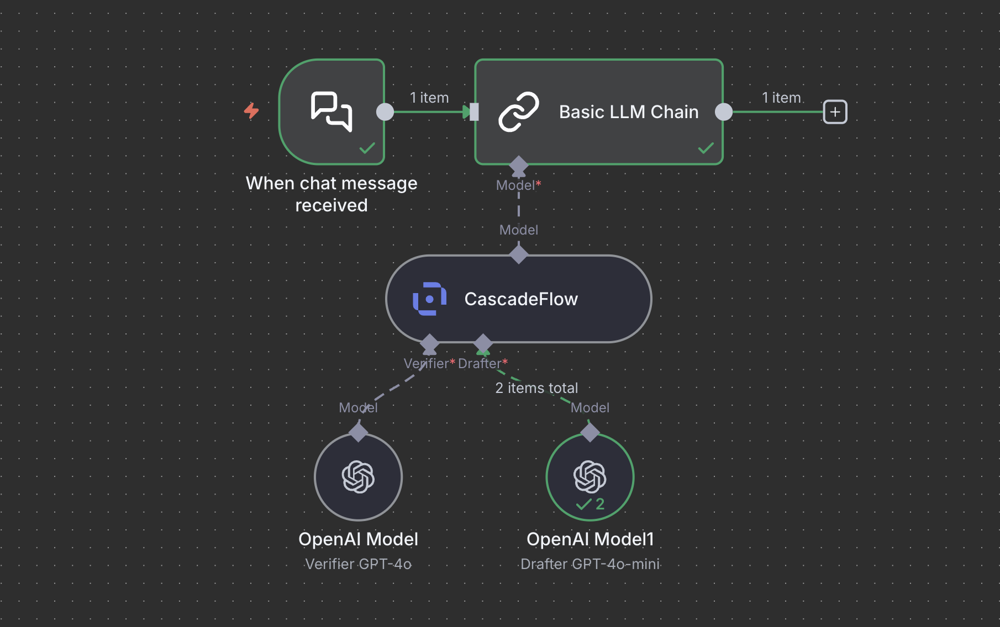

<div align="center">

<picture>
  <source media="(prefers-color-scheme: dark)" srcset="../../../.github/assets/CF_logo_bright.svg">
  <source media="(prefers-color-scheme: light)" srcset="../../../.github/assets/CF_logo_dark.svg">
  
</picture>

# @cascadeflow/n8n-nodes-cascadeflow

[](https://www.npmjs.com/package/@cascadeflow/n8n-nodes-cascadeflow)
[](../../../LICENSE)
[](https://n8n.io/)

** n8n community node for cascadeflow**

</div>

> **⚠️ IMPORTANT: Version Migration (v5.0.x → v0.5.0)**
>
> If you previously installed versions **5.0.1** through **5.0.7**, you need to **manually reinstall** to get v0.5.0:
>
> 1. Go to **Settings** > **Community Nodes** in n8n
> 2. **Uninstall** `@cascadeflow/n8n-nodes-cascadeflow`
> 3. **Reinstall** by searching for `@cascadeflow/n8n-nodes-cascadeflow`
>
> **Why?** Versions 5.0.x were published with incorrect version numbering. We've corrected this to align with the main cascadeflow release (v0.5.0). npm will not auto-upgrade from 5.0.x to 0.5.0 as it treats it as a downgrade.

---

**Intelligent AI model cascading for n8n workflows.**

This is an n8n community node that brings cascadeflow's intelligent AI model cascading to n8n workflows.

**cascadeflow** reduces LLM API costs by 40-85% by trying a cheap model first, validating quality, and only escalating to expensive models when needed.

[n8n](https://n8n.io/) is a fair-code licensed workflow automation platform.

## How It Works

The CascadeFlow node is a **Language Model sub-node** that sits between your AI models and downstream n8n nodes (like Basic LLM Chain, Chain, or any node that accepts Language Model inputs):



**Architecture:**

```
┌─────────────┐
│  Drafter    │ (e.g., Claude Haiku, GPT-4o-mini)
│  AI Model   │
└──────┬──────┘
       │
       ├──────► ┌──────────────┐
       │        │  CascadeFlow │
       │        │     Node     │ ────► ┌──────────────┐
       │        └──────────────┘       │ Basic Chain  │
       ├──────► Quality checks         │ Chain        │
       │        Cascades if needed     │ & more       │
       │                                └──────────────┘
┌──────┴──────┐
│  Verifier   │ (e.g., Claude Sonnet, GPT-4o)
│  AI Model   │
└─────────────┘
```

**Flow:**
1. Query goes to cheap drafter model first
2. CascadeFlow validates the response quality
3. If quality passes → return drafter response (fast + cheap ✅)
4. If quality fails → escalate to verifier model (slower but accurate ⚠️)

**Result:** 70-80% of queries accept the drafter, saving 40-85% on costs.

> **ℹ️ Note:** CascadeFlow works with n8n Chain nodes but **not with AI Agent nodes**, as n8n only allows whitelisted models for Agent inputs. Use with Basic LLM Chain, Chain, or other nodes that accept Language Model connections.

## Installation

Follow the [installation guide](https://docs.n8n.io/integrations/community-nodes/installation/) in the n8n community nodes documentation.

### Community Nodes (Recommended)

1. Go to **Settings** > **Community Nodes**
2. Select **Install**
3. Enter `@cascadeflow/n8n-nodes-cascadeflow` in **Enter npm package name**
4. Agree to the risks and install

### Manual installation

To get started install the package in your n8n root directory:

```bash
npm install @cascadeflow/n8n-nodes-cascadeflow
```

For Docker-based deployments add the following line before the font installation command in your [n8n Dockerfile](https://github.com/n8n-io/n8n/blob/master/docker/images/n8n/Dockerfile):

```dockerfile
RUN cd /usr/local/lib/node_modules/n8n && npm install @cascadeflow/n8n-nodes-cascadeflow
```

## Quick Start

### Basic Setup

1. **Add two AI Chat Model nodes** (e.g., OpenAI Chat Model, Anthropic Chat Model, Ollama Chat Model)
   - Configure one as your **drafter** (cheap model like `gpt-4o-mini` or `claude-3-5-haiku-20241022`)
   - Configure one as your **verifier** (powerful model like `gpt-4o` or `claude-3-5-sonnet-20241022`)

2. **Add the CascadeFlow node**
   - Connect the drafter model to the **Drafter** input
   - Connect the verifier model to the **Verifier** input
   - Adjust the **Quality Threshold** (default: 0.7)

3. **Connect to a Chain node**
   - The CascadeFlow node outputs a Language Model connection
   - Connect it to nodes that accept AI models (Basic LLM Chain, Chain, etc.)
   - **Note:** Does not work with AI Agent nodes (n8n limitation)

### Example Workflow

```
┌──────────────────┐
│ When chat        │
│ message received │
└────────┬─────────┘
         │
         v
┌──────────────────┐       ┌──────────────────┐
│  OpenAI Model    │──────►│                  │
│  gpt-4o-mini     │       │  CascadeFlow     │       ┌──────────────────┐
└──────────────────┘       │  Node            │──────►│ Basic LLM Chain  │
                           │                  │       │                  │
┌──────────────────┐       │  Threshold: 0.7  │       └──────────────────┘
│  OpenAI Model    │──────►│                  │
│  gpt-4o          │       └──────────────────┘
└──────────────────┘
```

## Configuration

### Node Parameters

#### Quality Threshold (0-1)

Controls how aggressively to accept drafter responses:

- **0.5-0.6**: Very aggressive (maximum cost savings, ~80-90% acceptance)
- **0.7** (default): Balanced (good quality + savings, ~70-80% acceptance)
- **0.8-0.9**: Conservative (highest quality, ~50-60% acceptance)

Lower threshold = more cost savings, higher threshold = better quality assurance.

## Flow Visualization

### Viewing Cascade Decisions in Real-Time

CascadeFlow provides detailed logging of every cascade decision in n8n's UI:

1. **Execute your workflow** with the CascadeFlow node
2. **Click on the downstream Chain node** after execution (the node that receives CascadeFlow output)
3. **Navigate to the "Logs" tab**

You'll see detailed flow information like:

```
🎯 CascadeFlow: Trying drafter model...
   📊 Quality validation: confidence=0.85, method=heuristic
   🎯 Alignment: 0.82

┌─────────────────────────────────────────┐
│  ✅ FLOW: DRAFTER ACCEPTED (FAST PATH) │
└─────────────────────────────────────────┘
   Query → Drafter → Quality Check ✅ → Response
   ⚡ Fast & Cheap: Used drafter model only
   Confidence: 0.85 (threshold: 0.70)
   Quality score: 0.85
   Latency: 420ms
   💰 Cost savings: ~93.8% (used cheap model)
   📊 Stats: 7 drafter, 2 verifier
```

Or when escalating:

```
🎯 CascadeFlow: Trying drafter model...
   📊 Quality validation: confidence=0.62, method=heuristic

┌────────────────────────────────────────────────┐
│  ⚠️  FLOW: ESCALATED TO VERIFIER (SLOW PATH)  │
└────────────────────────────────────────────────┘
   Query → Drafter → Quality Check ❌ → Verifier → Response
   🔄 Escalating: Drafter quality too low, using verifier
   Confidence: 0.62 < 0.70 (threshold)
   Reason: Simple check failed (confidence: 0.62 < 0.70)
   Drafter latency: 380ms
   🔄 Loading verifier model...
   ✅ Verifier completed successfully
   Verifier latency: 890ms
   Total latency: 1270ms (drafter: 380ms + verifier: 890ms)
   💰 Cost: Full verifier cost (0% savings this request)
   📊 Stats: 7 drafter (77.8%), 2 verifier
```

### What the Logs Show

- **Flow path taken**: Drafter accepted, escalated to verifier, or error fallback
- **Quality scores**: Confidence level and alignment scores
- **Latency breakdown**: Time spent on each model
- **Cost analysis**: Savings percentage for each request
- **Running statistics**: Acceptance rate across all requests

## Recommended Model Configurations

### ⭐ Best Overall: Claude Haiku + GPT-4o (Recommended)

```
Drafter: claude-3-5-haiku-20241022
Verifier: gpt-4o
Savings: ~73% average
Why: Haiku's fast, high-quality drafts + GPT-4o's reasoning
Use for: General purpose, coding, reasoning, complex queries
```

### Anthropic Only (High Quality)

```
Drafter: claude-3-5-haiku-20241022
Verifier: claude-3-5-sonnet-20241022
Savings: ~70% average
Why: Consistent Anthropic experience, excellent quality
```

### OpenAI Only (Good Balance)

```
Drafter: gpt-4o-mini
Verifier: gpt-4o
Savings: ~85% average
Why: Both models from same provider, great cost efficiency
```

### Ultra Fast with Ollama (Local)

```
Drafter: ollama/qwen2.5:3b (local)
Verifier: gpt-4o (cloud)
Savings: ~99% on drafter calls (no API cost)
Why: Local model for drafts, cloud for verification
Note: Requires Ollama installed locally
```

## Cost Savings Examples

**Example: Claude Haiku + GPT-4o**

| Scenario | Traditional (GPT-4o only) | CascadeFlow (Haiku + GPT-4o) | Savings |
|----------|---------------------------|------------------------------|---------|
| Simple Q&A (75% acceptance) | $0.0025 | $0.0008 | 68% |
| Complex query (25% escalation) | $0.0025 | $0.0025 | 0% (correctly escalated) |
| **Average** | **$0.0025** | **$0.00115** | **54%** |

**Monthly savings (10,000 queries):**
- Traditional (GPT-4o only): $25.00
- CascadeFlow (Haiku + GPT-4o): $11.50
- **You save: $13.50/month** (54% savings)

**Monthly savings (100,000 queries):**
- Traditional (GPT-4o only): $250.00
- CascadeFlow (Haiku + GPT-4o): $115.00
- **You save: $135.00/month** (54% savings)

## Example Workflows

### Customer Support Bot

```
┌──────────────────┐
│ Webhook          │ ← Customer question
│ (POST /support)  │
└────────┬─────────┘
         │
         v
┌─────────────────────────────────────┐
│  Claude Haiku ────┐                 │
│                   │  CascadeFlow    │       ┌──────────────────┐
│  Claude Sonnet ───┴─► Node          │──────►│  Basic Chain     │
└─────────────────────────────────────┘       │  (responds)      │
                                               └──────┬───────────┘
                                                      │
                                                      v
                                               ┌──────────────────┐
                                               │  Send Response   │
                                               └──────────────────┘
```

### Content Generation

```
┌──────────────────┐
│ Schedule Trigger │ ← Daily at 9am
│ (Daily)          │
└────────┬─────────┘
         │
         v
┌────────────────────────────────────────┐
│  GPT-4o-mini ─────┐                    │
│                   │  CascadeFlow       │       ┌──────────────────┐
│  GPT-4o ──────────┴─► Node             │──────►│  Basic Chain     │
└────────────────────────────────────────┘       │  (generates)     │
                                                  └──────┬───────────┘
                                                         │
                                                         v
                                                  ┌──────────────────┐
                                                  │  Save to Notion  │
                                                  └──────────────────┘
```

### Code Review Assistant

```
┌──────────────────┐
│ GitHub Trigger   │ ← New PR
│ (PR opened)      │
└────────┬─────────┘
         │
         v
┌─────────────────────────────────────┐
│  Ollama qwen2.5 ──┐                 │
│                   │  CascadeFlow    │       ┌──────────────────┐
│  GPT-4o ──────────┴─► Node          │──────►│  Basic Chain     │
└─────────────────────────────────────┘       │  (reviews code)  │
                                               └──────┬───────────┘
                                                      │
                                                      v
                                               ┌──────────────────┐
                                               │  Post Comment    │
                                               └──────────────────┘
```

## UI Visualization Note

⚠️ **Important:** Due to n8n's rendering conventions, the node visualization always highlights the **Drafter** connection as active (green), regardless of which model was actually used at runtime. This is because n8n highlights the first input in a sub-node's definition.

**This does not affect functionality** - the cascade logic works correctly. The drafter is always tried first, and the verifier is only loaded when needed.

**To see the actual cascade flow and which model was used:**

1. Execute your workflow
2. Click on the downstream Chain node after execution (the node that receives CascadeFlow output)
3. Navigate to the **"Logs"** tab
4. You'll see detailed flow information showing:
   - Whether the drafter was accepted or escalated to verifier
   - Quality confidence scores and validation methods
   - Latency breakdown for each model
   - Cost savings percentage
   - Running statistics across all executions

The logs provide complete visibility into the cascade decision-making process, showing exactly which path was taken for each request.

> **ℹ️ Important:** CascadeFlow does **not work with AI Agent nodes** in n8n, as n8n only allows whitelisted models for Agent inputs. Use with Basic LLM Chain, Chain, or other nodes that accept Language Model connections.

## Compatibility

- **n8n version**: 1.0+
- **Works with any AI Chat Model node** in n8n:
  - OpenAI Chat Model
  - Anthropic Chat Model
  - Ollama Chat Model
  - Azure OpenAI Chat Model
  - Google PaLM Chat Model
  - And more...

## Troubleshooting

### Issue: "Drafter model is required"

**Solution:** Make sure you've connected an AI Chat Model to the **Drafter** input (second input, bottom position).

### Issue: "Verifier model is required"

**Solution:** Make sure you've connected an AI Chat Model to the **Verifier** input (first input, top position).

### Issue: Not seeing cascade logs

**Solution:**
1. Make sure your workflow has executed successfully
2. Click on the **Chain node that receives the CascadeFlow output** (Basic LLM Chain, Chain, etc.)
3. Navigate to the **"Logs"** tab (not the "Output" tab)
4. The logs appear in the downstream node, not the CascadeFlow node itself

### Issue: "This node cannot be connected" when connecting to AI Agent

**Solution:** This is expected. CascadeFlow does **not work with AI Agent nodes** because n8n only allows whitelisted models for Agent inputs. Use CascadeFlow with:
- ✅ Basic LLM Chain
- ✅ Chain
- ✅ Other nodes that accept Language Model connections
- ❌ AI Agent (not supported)

### Issue: Always escalating to verifier

**Solution:**
1. Check your Quality Threshold setting (try lowering to 0.6-0.65)
2. Verify your drafter model is actually a cheaper/faster model
3. Check the logs to see the confidence scores being reported

## Resources

- [n8n community nodes documentation](https://docs.n8n.io/integrations/community-nodes/)
- [cascadeflow GitHub](https://github.com/lemony-ai/cascadeflow)
- [cascadeflow Documentation](https://github.com/lemony-ai/cascadeflow/blob/main/README.md)
- [Full n8n Integration Guide](https://github.com/lemony-ai/cascadeflow/blob/main/docs/guides/n8n_integration.md)

## License

[MIT](https://github.com/lemony-ai/cascadeflow/blob/main/LICENSE)

## Version History

### v0.5.0 (Latest)

**Major Release - Aligned with cascadeflow v0.5.0**

- **Flow visualization in n8n Logs tab**: Added detailed cascade flow logging with visual boxes showing drafter acceptance, verifier escalation, and error fallback paths
- **Real-time quality metrics**: Logs show confidence scores, alignment scores, latency breakdown, and cost savings for each request
- **Running statistics**: Track acceptance rates across multiple executions
- **Fixed UI visualization**: Swapped input order to match n8n's highlighting convention (Drafter now highlights as active)
- **Auto-dependency installation**: Moved @cascadeflow/core from optionalDependencies to regular dependencies
- **Crash fix**: Fixed n8n crashes caused by @cascadeflow/core static imports loading ML dependencies
- **Dynamic imports**: SemanticQualityChecker now uses dynamic imports to avoid loading @xenova/transformers at module initialization
- **Quality validator integration**: Integrated QualityValidator from @cascadeflow/core for improved quality scoring
- **Better cascade decisions**: Replaced naive length-based quality check with proper complexity-aware validation
- **Graceful degradation**: Added CASCADE_QUALITY_CONFIG with useSemanticValidation: false for stable operation

> **Note:** Versions 5.0.1 through 5.0.7 were deprecated due to incorrect version numbering. If upgrading from 5.0.x, please uninstall and reinstall.

### v0.4.19 and earlier

- Initial releases as LangChain sub-node
- Support for any AI Chat Model in n8n
- Lazy verifier loading (only fetches when needed)
- Quality threshold configuration
- Console logging for cascade flow
